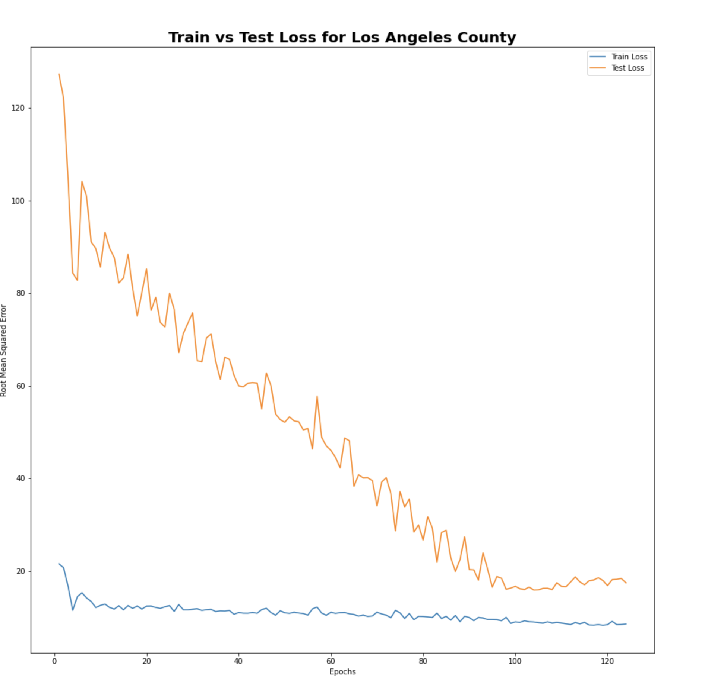
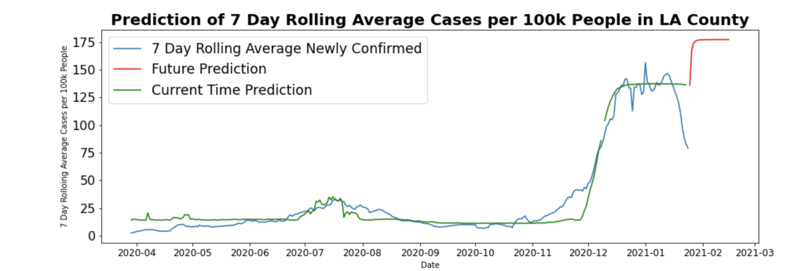
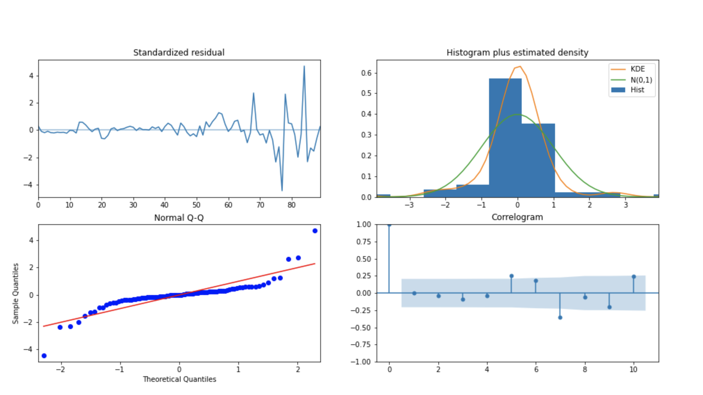
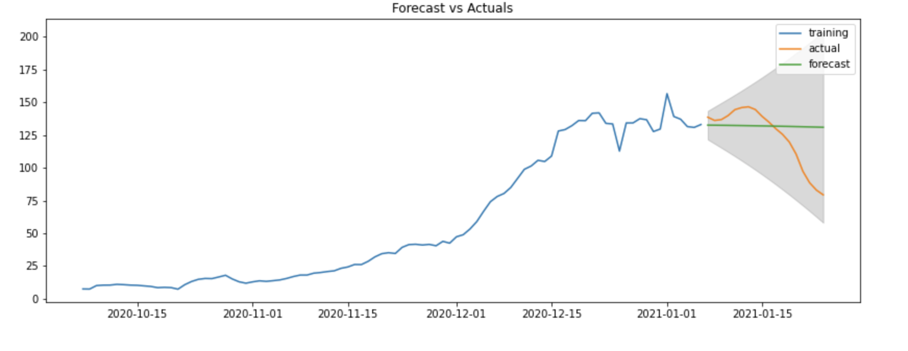
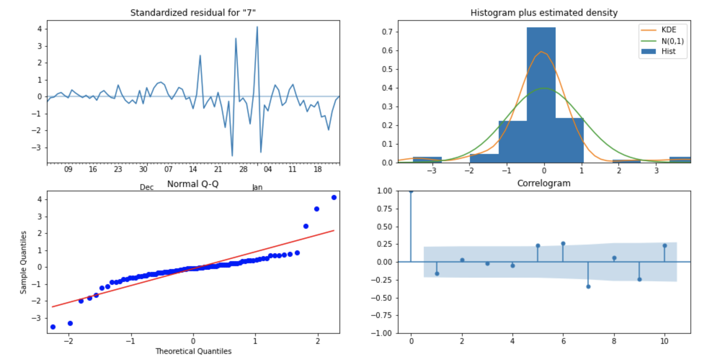
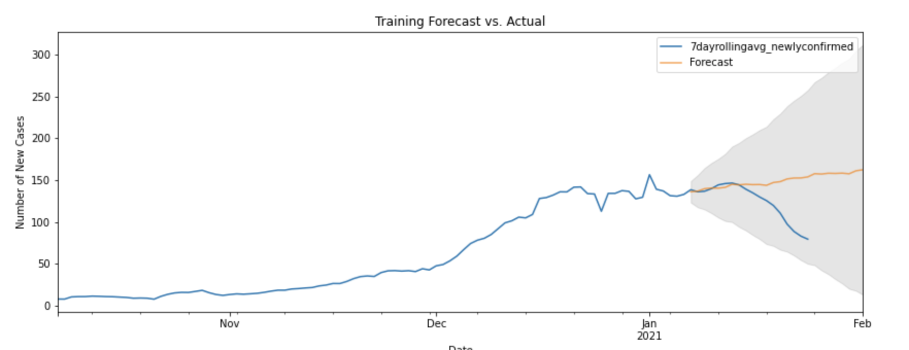

# Prediction of Covid Vaccine Distribution in California

# Table of contents

- [Table of contents](#table-of-contents)
- [Problem-Statement](#problem-statement)
- [Data-Acquisition](#data-acquisition)
- [Data-Cleaning](#data-cleaning)
- [EDA](#eda)
- [Modelling-Strategy](#modelling-strategy)
- [Observation and Conclusion](#observation-and-conclusion)
- [Additional Information](#additional-information)

# Problem-Statement
[(Back to top)](#table-of-contents)
Currently the COVID-19 vaccines developed by Moderna and Pfizer are being distributed based purely on population which is a huge problem in cases where an outbreak happens. As the COVID-19 vaccine comes in 2 doses that have to be taken 3 weeks apart, we would like to predict areas that are most likely to have an outbreak in 3 weeks time and allocate more vaccines accordingly. By doing this, we can reduce the spread more effectively rather than assuming that outbreaks are likely to only happen in areas of high population. 

Definitions for COVID-19 outbreaks are relative to the local context. A working definition of “outbreak” is recommended for planning investigations. A recommended definition is a situation that is consistent with either of two sets of criteria:
During (and because of) a case investigation and contact tracing, two or more contacts are identified as having active COVID-19, regardless of their assigned priority.
OR
Two or more patients with COVID-19 are discovered to be linked, and the linkage is established outside of a case investigation and contact tracing (e.g., two patients who received a diagnosis of COVID-19 are found to work in the same office, and only one or neither of the them was listed as a contact to the other).

# Data-Acquisition
[(Back to top)](#table-of-contents)

The Primary Source for Covid Data comes from California CoVid website. The following data sets were used:

(1.) **Hospitals_by_county.csv**: This file has a information by County on confirmed and suspected Covid Patients, along with total hospital beds and ICU beds. The data will be used to track County wise hospital capacity.

(2.)**Cases_with_mask_use.csv**: The file has data by county on total number of confirmed patients, total deaths by date.

(3.)**scrapped_vaccine.csv**: This file has Statewise dosage allocation , distribution and adminstration of vaccine in US

# Data-Cleaning
[(Back to top)](#table-of-contents)

As we know all data is messy, we want to do some cleaning before we move on to EDA and modeling. To do this we are used the pandas library in Python to read in the csv files we collected and cleaned the data by filling in null values, as well as merging datasets together. Another thing we did was web scraping the CDC site that tracks the number of vaccines administered per state using a cron job as there was no dataset that contained the daily values for this. The code used to web scrape is available in **vaccine_scraper.py** file.

# EDA
[(Back to top)](#table-of-contents)

 There are two suppliers for COVID vaccine so far, Pfizer and Moderna, we acquired both data from Data.CDC.gov, since they are provided by HHS, both data are in same form. 
- For our project purpose, I have to merge them together, I removed some islands given most of their data are NaNs, then removed the punctuations and converted them to numeric data for merging later. I only kept the first allocation data, since they are identical with the second allocation. After combined the vaccine data from Pfizer and Moderna, I also add in the population for each states. 
- We scrapped the accumulative vaccine distribution and admonition data per state from CDC Data Tracker, I took out only the California data, and create extra columns for each existing columns for the daily change.

# Modelling-Strategy
[(Back to top)](#table-of-contents)

### Stage 1:
In order to predict the number of COVID-19 cases in each county in California, we decided to build 3 models: a Long short-term Memory(LSTM) neural network using Tensorflow, an ARIMA model using pmdarima, and a SARIMA model using statsmodels. As neural networks tend to overfit, we solved part of this issue by using dropout layers, L2 regularization in our hidden layers, as well as early stopping. The neural network structure we decided to go with was 5 layers in the following order: A 128 node LSTM input layer, a 64 node LSTM layer, a 32 node dense layer with an L2 regularization of 0.001, a 16 node dense layer with an L2 regularization of 0.001, and finally an output layer of 1 containing the predictions of the model. Each hidden layer had a dropout layers of 0.2. One additional issue with using an LSTM neural network was we were only able to use one feature to generate our predictions, so we decided to use the number of hospitalized COVID-19 patients to predict the number of cases as the 2 are highly correlated. Also, as we had to do modeling for all 58 counties, we did not gridsearch any hyperparameters to improve our models. Using the following topology we were able to achieve a root mean squared error of 8.51 for our training data and a root mean squared error 17.39 for our testing data. Below is a graph of the training vs testing loss of our model over 124 epochs for Los Angeles county.

Of course, one of the challenges we faced while trying to make predictions for each county is being able to predict drastic changes in the number of COVID-19 cases in a county. A perfect example of this is LA County where we can see that our model predicts early data quite well, however it is late on the spike between November and December and doesn't adapt well to the sudden decrease in the past few datas as seen below. 

In the case of our ARIMA model, we used the auto arima function to automatically pick the best parameters for us. We found that the best parameters were 0 time lags for our p, subtracting 2 times from past values of our data for d, and a moving average of 2 for our q. Here we have our diagnostics for our ARIMA model. We see with the residuals that they are fairly steady in the beginning but there is a lot more varience in our forcast as time moves on. For our Q-Q plot, optimally we are looking for a straight line which we almost have, however the linearity is problem at the extremities of the plot. Of course, the story is similar for our histogram plus estimated density and correlogram where we see that we can capture about 70-80% of the data accurately, but can't really predict extremes.

Unfortunately, we did not see much improvements between our LSTM neural network and ARIMA as our predictions and the actual results are still differ a lot as can be seen below using LA County as an example again. Also the root mean squared error is 22.89 for our testing set using ARIMA, so it is slightly worse than our LSTM model.

Next we moved on to testing our a SARIMAX model to see if adding in a seasonality factor to our time series model could improve it. Again, we tested a varity of parameters for p, d, and q to see which parameters would be the best to use. In this case our parameters are slight different from our ARIMA model where our p, d, and q are 0, 1, and 1 respectively. Looking at the diagnostics for our SARIMAX model, we again have a similar story compared to our ARIMA model. In most cases, it unfortunately looks worse that our ARIMA model as can be seen below.

Again we see that our predictions are much worse than the actual values, and actually do worse than both ARIMA and LSTM. Our RMSE when predicting cases for LA County was 41.43 using SARIMAX.

In the end, we see that LSTM was able to predict one of the counties with the most varience the best so we decided to use it to predict the number of COVID-19 Cases in every county using LSTM.

### Stage 2:
Once we complete the predictions on Covid patients, the next step was to evaluate Distribution and Adminstration data by County per day.

Below data set was used to analyse the resource allocation problem:
California - Vaccine Allocation by Week
California - Vaccine Distribution by Week
California - Vaccine Adminstration by Week

California (by County)  - Prediction of Number of New Patients per day for Rolling 7 days per 100K

There were two challenges with the above data set :

(1.) **Granularity** : Allocation, Distribution and Administration Data existed at State and Week level and Predictions at County and Day level.

(2.) **Extend of Data** The Vaccine Allocation / Distribution / Adminstration information existed only till 1/26/2021. As we the predictions were to be made for data post 1/26/2021, we have used Time Series ( AutoReg ) to create daily dataset post 1/26/2021. This data has also been manually edited based on inputs from Press Release made by the President on number of Vaccines to be distributed till July 2021 to address the entire US population.

# Observation and Conclusion
[(Back to top)](#table-of-contents)

The primary findings from this study are as follows:

(1.) With 2.8MM vaccines allocated to California over next 22 weeks ( till July 2021), no county within California should have a shortfall for vaccinating everyone.

(2.) There is uncertainity and external factors that impact the findings from this study. These include (but are not restricted to) Goverment decisions, cadence of vaccine distribution and adminstration, spread of new strain of virus, opening up of cities and suburbs, which may have impact on the spread of virus. A majority of these decisions are driven by goverment policy. All factors remaining the same, there results from the study can be implemented.

(3.) Counties in Southern California esp. Los Angeles, Orange County and Riverside are expected to have a spike in new cases 
(by volume) and Los Angeles, Marin County and Kern County will see a spike (by density). Recommendation is to keep a watch on the number of Covid Patients in these counties in case vaccine resource reallocation is needed.

(4.) This study also raises the question of ethics around life saving resource allocation. Using data techniques to divert life saving technology brings up the consideration on making decision whose impact can be irreversible. Also, the disease may impact demographics like age, gender, race ( and other ethonographic parameters) differently which introduces complexity in the decision making.

# Additional Information And Citations
[(Back to top)](#table-of-contents)

Citations:
https://covid.cdc.gov/covid-data-tracker/#vaccinations
<<<<<<< HEAD
https://www.bloomberg.com/news/articles/2021-01-26/biden-team-tells-governors-it-will-speed-up-vaccine-delivery

  
=======
https://public.tableau.com/views/COVID-19CasesDashboard_15931020425010/Cases?:embed=y&:showVizHome=no 
>>>>>>> bf2d555eeb584e2b624b30785641640ada91c8c1
